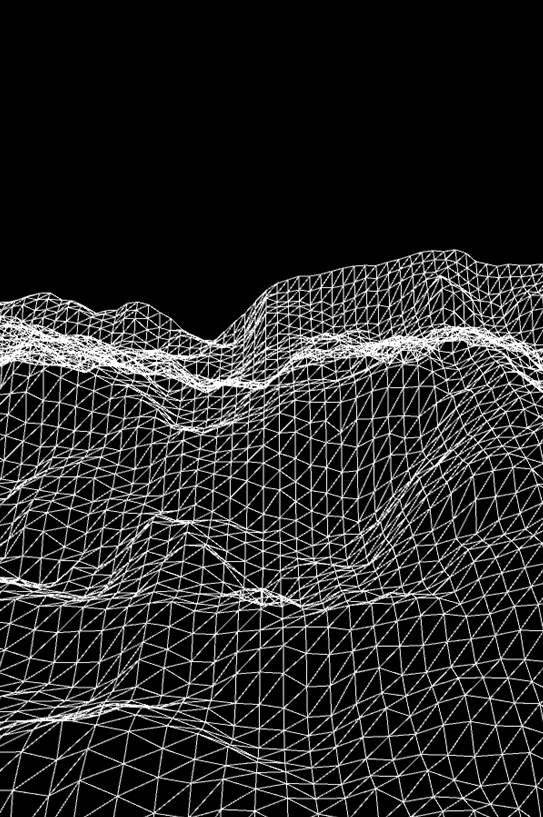

# Perlin Noise Terrain Generation

Perlin Noise Terrain Generation simulates flying over procedurally-generated terrain.  
Start date: 2020-10-30  

## Demo

## Dependencies

- [Processing 4.0 beta 1](https://processing.org/download)

## Installation

Open any of the `*.pde` files with Processing (IDE).

## Usage

Launch the program using Processing (IDE).

## Acknowledgements

- Inspired by [a video on YouTube](https://www.youtube.com/watch?v=IKB1hWWedMk).

## Author

- **Jeffrey Andersen** &mdash; [GitHub Profile](https://github.com/anderjef) &bull; [Website](https://anderjef.github.io)

## License

For copyright, license, and warranty, see [LICENSE.md](LICENSE.md).
